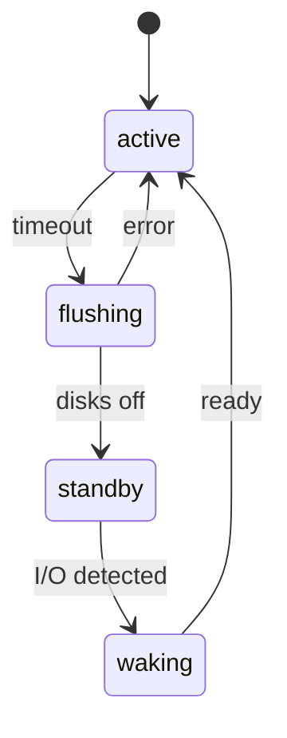

# Spindown Daemon API

**spind.py** — демон засыпания дисков RAID-массивов (Backup Mode).

- **Размещение:** `/usr/lib/rusnas/spind/spind.py`
- **Сервис:** `rusnas-spind.service`
- **State:** `/run/rusnas/spindown_state.json` (runtime)
- **Config:** `/etc/rusnas/spindown.json`

## State Machine

## CGI — spindown_ctl.py

**Размещение:** `/usr/lib/rusnas/cgi/spindown_ctl.py`

| Команда | Описание |
|---------|----------|
| `get_state` | Текущее состояние массивов |
| `get_config` | Конфигурация Backup Mode |
| `set_config` | Обновить конфигурацию |
| `wake_up` | Принудительное пробуждение |
| `spindown_now` | Принудительное засыпание |
