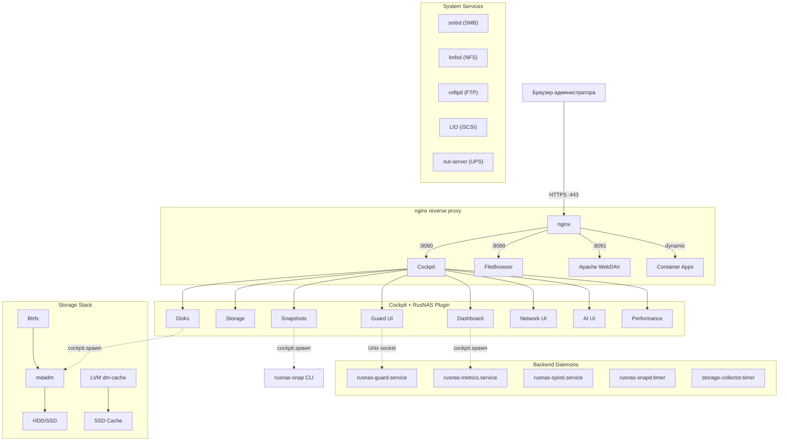

# Обзор архитектуры

## Уровневая модель

| Уровень | Компонент | Технология |
|---------|-----------|------------|
| L1. Аппаратный | Диски HDD/SSD/NVMe, NIC, UPS | SATA/SAS/NVMe, Ethernet |
| L2. Ядро ОС | md (RAID), dm-cache, inotify, nftables | Linux 6.x |
| L3. Хранилище | mdadm, Btrfs, LVM | Программный RAID + CoW FS |
| L4. Сетевые сервисы | Samba, knfsd, vsftpd, Apache WebDAV, LIO | SMB/NFS/FTP/WebDAV/iSCSI |
| L5. Демоны | Guard, spind, metrics_server, NUT | Python 3, systemd |
| L6. API/CGI | network-api, container_api, storage-analyzer-api | Python 3, cockpit.spawn |
| L7. Веб-интерфейс | Cockpit + RusNAS плагин (12 страниц) | HTML5/CSS3/JS ES5 |
| L8. Reverse proxy | nginx (:80/:443) | HTTP/HTTPS |
| L9. Контейнеры | Podman (10 приложений) | OCI, podman-compose |

## Компонентная диаграмма



## Ключевые архитектурные решения

### Btrfs + mdadm вместо ZFS

ZFS не поддерживает онлайн-миграцию уровня RAID (5→6), что является жёстким бизнес-требованием. Btrfs + mdadm предоставляет:

- Снапшоты (CoW, мгновенные)
- Online resize
- Subvolumes
- Reflinks (дедупликация)
- `mdadm --grow --level` для апгрейда RAID

### Cockpit как UI-платформа

- PAM-аутентификация (системные учётки)
- WebSocket-транспорт (cockpit.spawn, cockpit.file)
- Модульная система плагинов
- Авто-reload при обновлении файлов

### nginx как единая точка входа

```
:80/:443 → nginx
  /cockpit/    → :9090 (Cockpit)
  /files/      → :8088 (FileBrowser)
  /webdav/     → :8091 (Apache)
  /nextcloud/  → :8080 (Container)
  /chat/       → :3000 (Rocket.Chat, 3 location блока)
```
