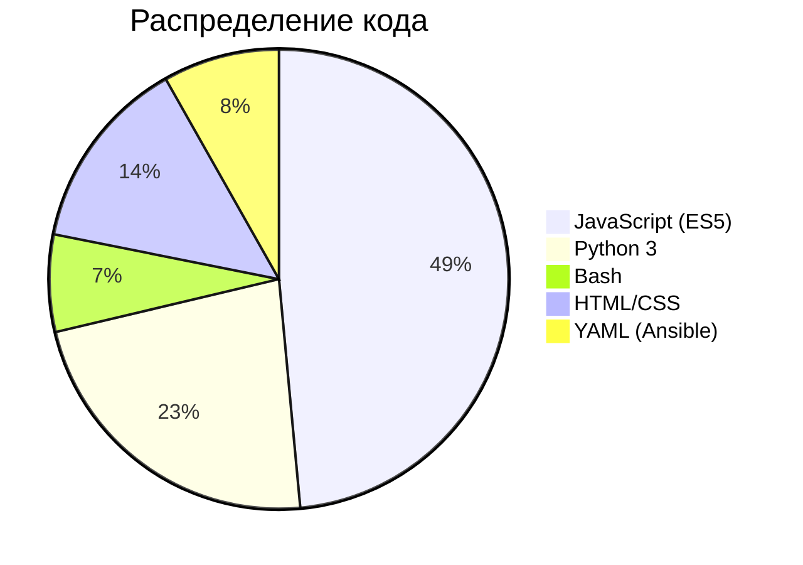

# Технологический стек

| Компонент | Технология | Версия | Назначение |
|-----------|------------|--------|------------|
| ОС | Debian GNU/Linux | 13 Trixie | Базовая операционная система |
| RAID | mdadm | 4.3 | Программные массивы (0/1/5/6/10/JBOD) |
| Файловая система | Btrfs | btrfs-progs 6.x | CoW FS, снапшоты, subvolumes, reflinks |
| SSD-кеш | LVM dm-cache | LVM2 | Кеширование RAID на SSD |
| SMB/CIFS | Samba | 4.x | Сетевой доступ (Windows) |
| NFS | knfsd | kernel | Сетевой доступ (Linux/Unix) |
| FTP | vsftpd | 3.x | File Transfer Protocol |
| WebDAV | Apache + mod_dav | 2.4 | HTTP-based file access |
| iSCSI | targetcli-fb (LIO) | kernel | Блочный доступ |
| ИБП | NUT | 2.8.1 | Network UPS Tools |
| Файрвол | nftables | kernel | Сетевая фильтрация |
| Контейнеры | Podman + podman-compose | 4.x | OCI-контейнеры (rootful) |
| Reverse proxy | nginx | 1.24+ | Единая точка входа :80/:443 |
| Веб-UI | Cockpit | 337+ | Платформа администрирования |
| Frontend | JavaScript ES5 | - | Cockpit плагин (15 файлов) |
| Backend | Python 3 | 3.11+ | Демоны, API, CLI |
| Метрики | Prometheus-compatible | HTTP :9100 | metrics_server.py |
| Провизионирование | Ansible | 2.x | Monorepo с ролями |
| Обновления | apt + reprepro | - | deb-репозиторий с лицензионной авторизацией |

## Языки программирования

## Зависимости Python (backend)

| Пакет | Используется в | Назначение |
|-------|---------------|------------|
| bcrypt | guard.py | Хеширование PIN-кода Guard |
| duperemove | dedup | Дедупликация (Btrfs reflinks) |
| sqlite3 | snaps.db, storage_history.db | Хранение метаданных |
| inotify_simple | detector.py | Мониторинг файловой системы (Guard) |
| FastAPI | license-server | HTTP API лицензирования |
| cryptography (Ed25519) | license-server | Подпись лицензий |

## Зависимости JavaScript (frontend)

Нет внешних JS-библиотек. Весь код — vanilla JavaScript (ES5):

- `cockpit.js` (предоставляется Cockpit)
- SVG-спарклайны рисуются вручную
- Treemap — собственная реализация squarified-алгоритма
- Donut chart — SVG arc paths
