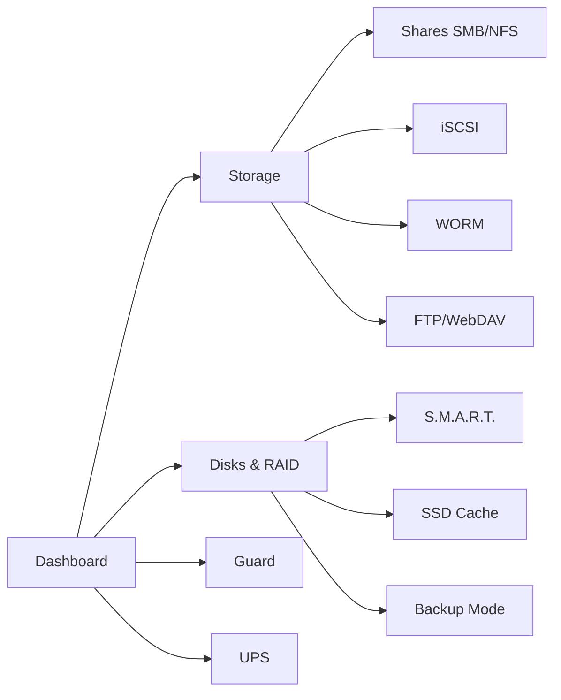

# RusNAS Documentation

**RusNAS** — коммерческая платформа управления сетевым хранилищем данных. Альтернатива Synology DSM для SMB-сегмента (1000+ устройств).

## Быстрые ссылки

| Раздел | Описание |
|--------|----------|
| [Архитектура](architecture/overview.md) | Обзор системы, компонентная модель, уровни |
| [Спецификации модулей](specs/guard.md) | Детальные ТЗ на каждый модуль |
| [JavaScript API](api/js/eye.md) | Авто-документация из JSDoc (Cockpit плагин) |
| [Python API](api/python/guard.md) | Авто-документация из docstrings (backend) |
| [Руководство разработчика](guides/getting-started.md) | Setup, паттерны, деплой |

## Ключевые решения

- **Btrfs + mdadm** вместо ZFS (онлайн-миграция уровня RAID)
- **Cockpit** как UI-платформа (PAM, WebSocket, плагины)
- **nginx** как единая точка входа (:80/:443)
- **Podman** для контейнерных приложений (rootful mode)

## Модули системы (12 страниц)



## Сборка документации

```bash
npm run docs          # Полная сборка → docs-site/
npm run docs:serve    # Локальный сервер http://localhost:8000
```
