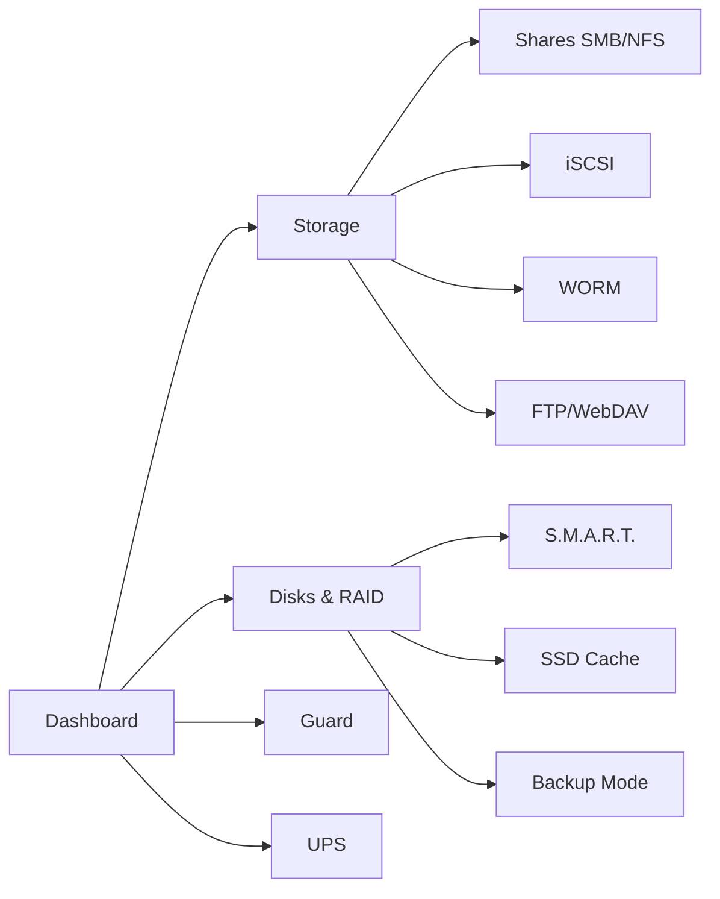

# Документация RusNAS

**RusNAS** — коммерческая платформа управления сетевым хранилищем данных. Отечественная альтернатива Synology DSM для SMB-сегмента (1000+ устройств).

## Быстрые ссылки

| Раздел | Описание |
|--------|----------|
| [Архитектура](architecture/overview.md) | Обзор системы, компонентная модель, уровни |
| [Спецификации модулей](specs/guard.md) | Детальные ТЗ на каждый модуль (12 модулей) |
| [JavaScript API](api/js/eye.md) | Авто-документация из JSDoc (15 файлов Cockpit-плагина) |
| [Python API](api/python/guard.md) | Авто-документация из docstrings (9 backend-файлов) |
| [Руководство разработчика](guides/getting-started.md) | Настройка среды, паттерны, деплой |

## Ключевые архитектурные решения

- **Btrfs + mdadm** вместо ZFS — онлайн-миграция уровня RAID (5→6)
- **Cockpit** как UI-платформа — PAM-аутентификация, WebSocket, модульные плагины
- **nginx** как единая точка входа — :80/:443, reverse proxy для всех сервисов
- **Podman** для контейнерных приложений — rootful mode, 10 приложений из каталога

## Модули системы (12 страниц Cockpit-плагина)



## Сборка документации

```bash
npm run docs          # Полная сборка → docs-site/
npm run docs:serve    # Локальный сервер http://localhost:8000
```
