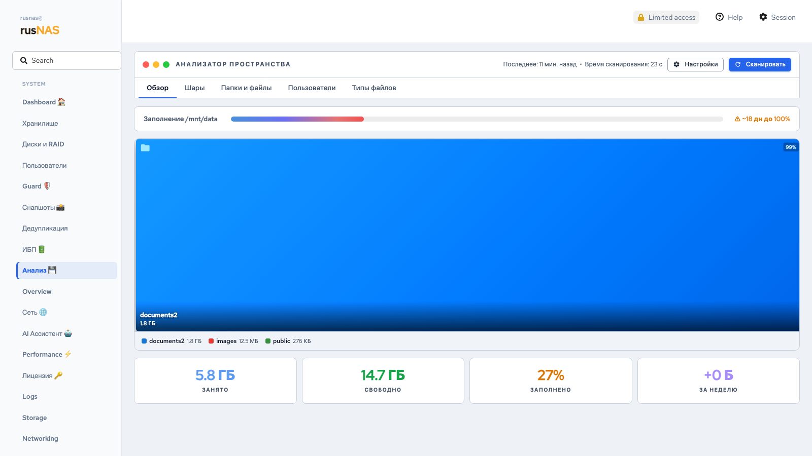

# Анализатор пространства

*Рис. Анализатор пространства — обзор*

Анализатор пространства предоставляет детальную информацию об использовании дискового пространства: от общей картины заполнения томов до анализа отдельных файлов и прогноза заполнения.

---

## Где найти

Откройте страницу **Анализ** в боковой панели. Также можно перейти к анализатору с дашборда, нажав на карточку "Хранилище".

## Пять вкладок

### 1. Обзор

Главная вкладка с общей картиной:

**Карточки сводки:**

| Карточка | Описание |
|---------|----------|
| **Общий объём** | Суммарная ёмкость всех томов |
| **Использовано** | Объём занятого пространства |
| **Свободно** | Доступное пространство |
| **Прогноз заполнения** | Расчётная дата, когда закончится место (на основе тренда) |

**Карта томов** -- визуальное представление всех томов с пропорциональными размерами блоков.

**Полоска заполнения** -- SVG-визуализация использования каждого тома с цветовой индикацией:

- Зелёный -- использование менее 70%
- Жёлтый -- использование 70-85%
- Красный -- использование более 85%

**Топ потребителей** -- список директорий и шар, занимающих больше всего места.

!!! note "Примечание"
    Прогноз заполнения рассчитывается методом линейной регрессии на основе истории сканирований. Для точного прогноза необходимо минимум 2 точки данных (сканирования).

### 2. Шары

Детальная таблица по каждой общей папке:

| Столбец | Описание |
|---------|----------|
| **Имя** | Название шары |
| **Путь** | Расположение на диске |
| **Размер** | Текущий занятый объём |
| **Тренд** | Мини-график (sparkline) изменения размера за последнее время |
| **Прогноз** | Индивидуальный прогноз роста |

Нажмите на строку для раскрытия дополнительной информации.

### 3. Папки и файлы

Интерактивная карта файлов (treemap), где размер каждого блока пропорционален размеру файла или папки.

**Навигация по treemap:**

- Нажмите на папку для входа в неё
- Используйте хлебные крошки над картой для возврата на уровень выше
- Цвет блоков зависит от типа файла

**Фильтры:**

| Фильтр | Описание |
|--------|----------|
| **Тип файла** | Показать только определённый тип: документы, изображения, видео и т.д. |
| **Сортировка** | По размеру (по умолчанию) или по дате |
| **Старше чем** | Показать только файлы старше указанного периода |

**Переключение вида:**

- **Карта (treemap)** -- визуальное представление пропорций
- **Список** -- табличный вид с сортировкой

### 4. Пользователи

Использование пространства по учётным записям:

| Столбец | Описание |
|---------|----------|
| **Пользователь** | Имя учётной записи |
| **Занято** | Объём файлов пользователя |
| **Квота** | Установленный лимит (если настроен) |
| **Использование** | Процент использования квоты |

### 5. Типы файлов

Анализ занятого пространства по типам файлов:

**Кольцевая диаграмма (donut chart)** показывает пропорции:

- Документы (DOC, PDF, XLS и др.)
- Изображения (JPG, PNG, RAW и др.)
- Видео (MP4, MKV, AVI и др.)
- Аудио (MP3, FLAC, WAV и др.)
- Архивы (ZIP, RAR, 7Z и др.)
- Прочее

**Таблица** под диаграммой содержит детализацию по каждому типу. Нажмите на строку для перехода на вкладку "Папки и файлы" с фильтром по этому типу.

## Обновление данных

Данные анализатора собираются автоматически каждый час (с случайной задержкой до 5 минут для распределения нагрузки). При первом открытии используются кешированные данные для быстрой загрузки.

!!! tip "Совет"
    Если данные кажутся неактуальными (например, после массового удаления файлов), подождите до следующего часового сканирования или инициируйте его вручную через SSH.

---

**См. также:** [Дедупликация](../dedup/index.md) | [Общие папки](../storage/shares.md)
