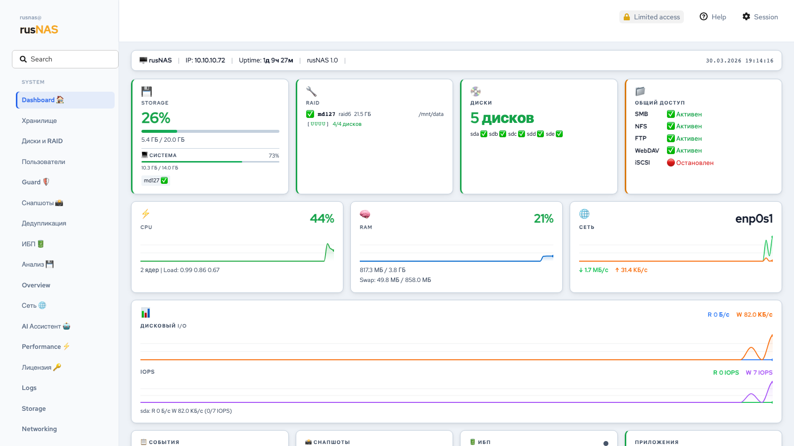
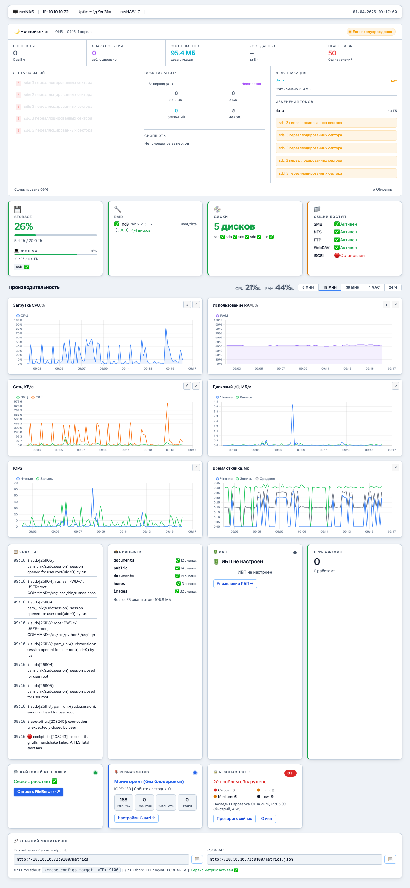
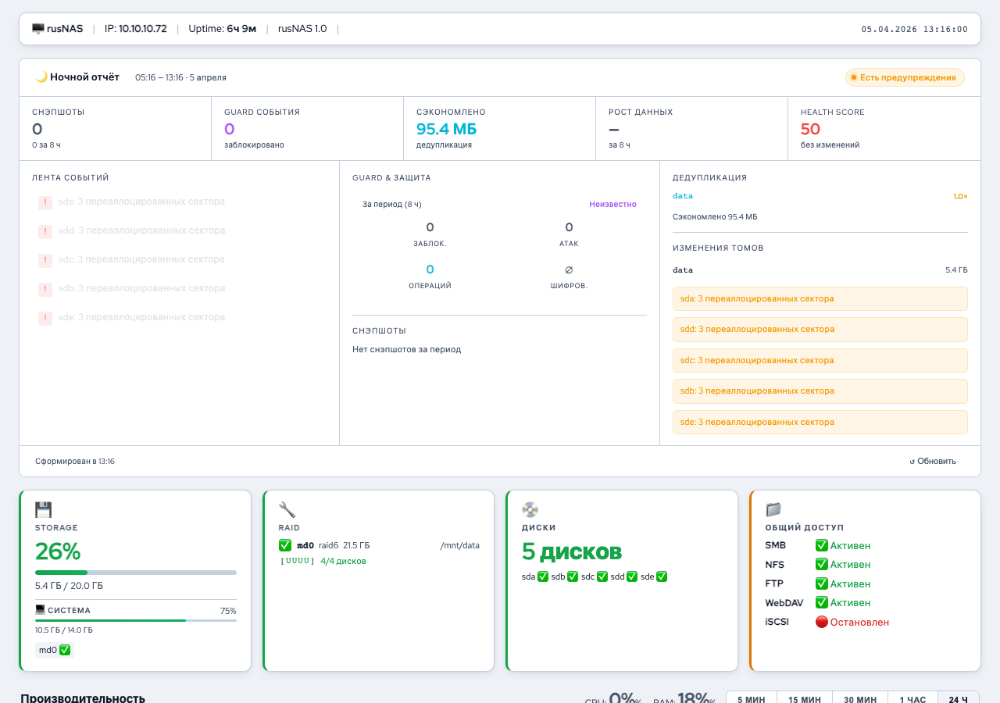

# Дашборд

Дашборд — главная страница rusNAS. Показывает состояние всей системы в реальном времени: хранилище, RAID, диски, сервисы, производительность.

---

## Обзор интерфейса

### Верхняя панель

Информационная строка с именем хоста, IP-адресом, временем работы (uptime) и версией rusNAS.

### Карточки состояния

Четыре карточки в верхней части:

| Карточка | Что показывает |
|----------|----------------|
| **Storage** | Процент заполнения, использованное / общее пространство |
| **RAID** | Массив, уровень, размер, статус (здоровый / деградированный) |
| **Диски** | Количество подключённых дисков |
| **Общий доступ** | Статус сервисов: SMB, NFS, FTP, WebDAV, iSCSI |

Клик по карточке **Storage** переходит в [Анализатор пространства](../analyzer/index.md).

## Графики производительности

Шесть графиков в реальном времени с историей до 24 часов:

- **Загрузка CPU, %** — общая загрузка процессора
- **Использование RAM, %** — оперативная память
- **Сеть, КБ/с** — входящий (RX) и исходящий (TX) трафик
- **Дисковый I/O, МБ/с** — скорость чтения и записи
- **IOPS** — операции ввода-вывода в секунду
- **Время отклика, мс** — латентность дисковой подсистемы

### Переключение периода

Кнопки справа от заголовка: **5 мин**, **15 мин**, **30 мин**, **1 час**, **24 ч**.

### Подробности CPU и RAM

Нажмите кнопку **(i)** на графике CPU или RAM для подробной информации:

- **CPU**: список процессов по загрузке, количество ядер, частота
- **RAM**: разбивка памяти (Apps / Buffers / Cache / Shared / Slab / Free), таблица процессов по потреблению

## Нижние карточки

| Карточка | Описание |
|----------|----------|
| **События** | Последние системные события и события Guard |
| **Снапшоты** | Статус снапшотов по каждому субтому |
| **ИБП** | Состояние UPS (если настроен): заряд, нагрузка, время автономии |
| **Приложения** | Количество работающих контейнерных приложений |

## Ночной отчёт (Night Report)

Блок под графиками — автоматическая сводка за последние 8 часов. Содержит:

- **Health Score** (0–100) — общая оценка состояния системы
- **5 карточек**: инциденты Guard, снапшоты, пиковая загрузка CPU, сетевой трафик, состояние SMART
- **3 колонки деталей**: события Guard, данные SMART по дискам, статус дедупликации и снапшотов

Кнопка **Обновить** позволяет пересчитать отчёт вручную.

!!! tip "Совет"
    Просматривайте ночной отчёт каждое утро — он покажет, было ли что-то важное пока вы отсутствовали.

## Автоматическое обновление

Данные обновляются автоматически:

| Данные | Интервал |
|--------|----------|
| CPU, RAM, сеть, I/O | 2 секунды |
| Guard статус | 10 секунд |
| UPS | 30 секунд |
| Снапшоты, приложения | 60 секунд |

При переключении на другую вкладку браузера обновление приостанавливается для экономии ресурсов.
