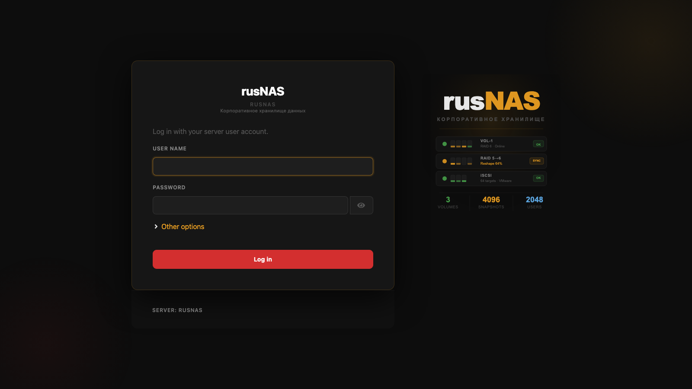

# Первый вход в систему


*Рис. Экран авторизации Cockpit*


После установки RusNAS веб-интерфейс управления доступен через браузер. Эта страница описывает, как войти в систему и выполнить первоначальную настройку.

---

## Требования

- Компьютер или мобильное устройство в одной сети с сервером RusNAS
- Современный браузер: Chrome, Firefox, Safari или Edge
- IP-адрес сервера RusNAS (по умолчанию назначается через DHCP)

## Открытие веб-интерфейса

1. Откройте браузер и введите в адресной строке:

    ```
    https://<IP-адрес>:9090
    ```

    Например: `https://192.168.1.100:9090`

2. Браузер может показать предупреждение о сертификате безопасности. Это нормально для первого подключения -- нажмите **"Дополнительно"** и **"Перейти на сайт"**.

!!! note "Порт 9090"
    Веб-интерфейс RusNAS работает на порту 9090. Не забудьте указать его после IP-адреса через двоеточие.

## Форма входа

На странице входа вы увидите два поля:

| Поле | Описание |
|------|----------|
| **Имя пользователя** | Системное имя пользователя Linux. По умолчанию: `rusnas` |
| **Пароль** | Пароль учётной записи, заданный при установке |

Введите учётные данные и нажмите кнопку **"Войти"**.

!!! warning "Внимание"
    Учётные данные для входа -- это системная учётная запись Linux, а не отдельный аккаунт веб-интерфейса. Пароль задаётся при установке ОС.

## Что вы увидите после входа

После успешной авторизации откроется **Дашборд** -- главная страница мониторинга. На ней отображаются:

- Текущая загрузка CPU и оперативной памяти
- Состояние дисков и RAID-массивов
- Статус Guard (антишифровальщик)
- Состояние ИБП (если подключён)
- Ночной отчёт (сводка за последние 8 часов)

## Первоначальная настройка

После первого входа рекомендуется выполнить следующие шаги в указанном порядке:

1. **Включить административный доступ** -- необходимо для большинства операций. См. [Административный доступ](admin-access.md).

2. **Проверить диски** -- откройте страницу **Диски и RAID** и убедитесь, что все физические диски обнаружены.

3. **Создать RAID-массив** -- объедините диски в массив нужного уровня. См. [Создание массива](../raid/create.md).

4. **Создать общие папки** -- настройте SMB и/или NFS шары для доступа к данным по сети. См. [Общие папки](../storage/shares.md).

5. **Создать пользователей** -- добавьте учётные записи для сотрудников. См. [Пользователи и группы](../users/index.md).

6. **Настроить Guard** -- включите защиту от шифровальщиков. См. [Guard: обзор](../guard/overview.md).

7. **Настроить снапшоты** -- включите автоматическое создание снимков данных. См. [Расписание снапшотов](../snapshots/schedule.md).

!!! tip "Совет"
    Все настройки можно менять в любое время. Последовательность выше -- рекомендация для быстрого запуска.

## Смена языка интерфейса

Интерфейс Cockpit автоматически определяет язык из настроек браузера. Если интерфейс отображается на английском:

1. Откройте настройки браузера
2. Добавьте русский язык в список предпочтительных
3. Переместите его на первое место
4. Обновите страницу RusNAS

## Доступ с мобильных устройств

Веб-интерфейс RusNAS полностью адаптирован для мобильных устройств. Откройте тот же адрес `https://<IP>:9090` в мобильном браузере. Навигация и основные операции доступны с любого экрана.

---

**Следующий шаг:** [Обзор интерфейса](interface.md)
