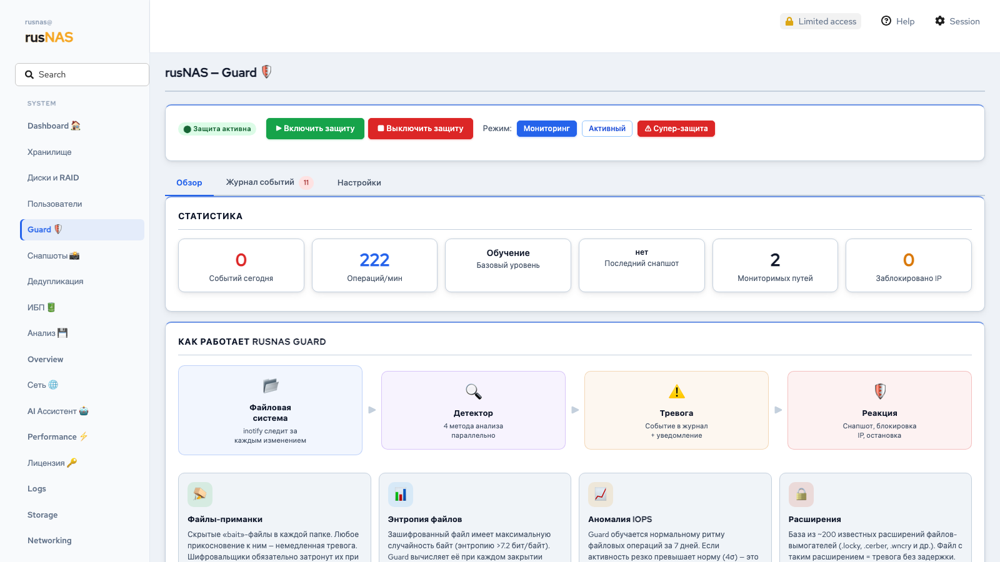

# Guard: защита от шифровальщиков


*Рис. Главная страница Guard — обзор*


Guard -- встроенная система защиты RusNAS от программ-шифровальщиков (ransomware). Guard отслеживает подозрительную активность на файловых шарах и может автоматически блокировать атаку, сохраняя данные.

---

## Как работает Guard

Guard работает в фоновом режиме и непрерывно анализирует файловые операции на защищаемых директориях. При обнаружении подозрительной активности Guard:

1. Фиксирует событие в журнале
2. В зависимости от режима: уведомляет администратора или блокирует источник атаки
3. Автоматически создаёт снапшот данных для восстановления

## Четыре метода обнаружения

Guard использует несколько независимых методов для максимальной надёжности:

### 1. Ловушки (Honeypot)

Система размещает специальные файлы-приманки в защищаемых директориях. Эти файлы невидимы для обычных пользователей, но шифровальщики пытаются зашифровать всё подряд. Изменение файла-приманки -- верный признак атаки.

### 2. Анализ энтропии

Шифровальщики превращают обычные файлы (документы, фото) в "шум" -- данные с высокой энтропией (случайностью). Guard измеряет энтропию изменяемых файлов. Если файл после изменения стал похож на случайный набор байтов -- это подозрительно.

### 3. Мониторинг IOPS

Шифровальщики обычно шифруют тысячи файлов за короткое время, создавая аномальный всплеск операций ввода-вывода. Guard отслеживает частоту файловых операций и реагирует на необычно высокую активность.

### 4. Контроль расширений

Guard содержит базу из ~200 расширений, характерных для зашифрованных файлов (`.encrypted`, `.locked`, `.cry` и т.д.). Появление файлов с такими расширениями -- сигнал тревоги.

## Три режима реагирования

| Режим | Описание | Когда использовать |
|-------|----------|-------------------|
| **Мониторинг** | Guard фиксирует события, но не предпринимает активных действий. Уведомляет администратора | Для наблюдения, тестирования, минимизации ложных срабатываний |
| **Активный** | Guard блокирует подозрительный источник (SMB-сессию) и создаёт снапшот | Рекомендуемый режим для рабочей среды |
| **Супер-безопасный** | Максимально агрессивное реагирование: мгновенная блокировка при первом подозрении | Для хранилищ с критически важными данными |

!!! tip "Совет"
    Рекомендуется начать с режима **Мониторинг** на 1-2 недели, чтобы убедиться в отсутствии ложных срабатываний, затем переключить в **Активный** режим.

## PIN-код Guard

Guard защищён собственным PIN-кодом, независимым от пароля учётной записи. PIN требуется для:

- Изменения режима работы
- Отключения Guard
- Разблокировки заблокированных пользователей
- Изменения настроек обнаружения

### Первоначальная установка PIN

При первом открытии страницы Guard система попросит задать PIN-код. Выберите надёжный код и запомните его.

### Восстановление PIN

Если PIN утерян, его можно сбросить только через SSH-доступ к серверу:

```
sudo rusnas-guard --reset-pin
```

!!! warning "Внимание"
    Разделение PIN-кода Guard и пароля администратора сделано намеренно. Даже если злоумышленник получит доступ к веб-интерфейсу, он не сможет отключить защиту без PIN.

## Где найти

Страница **Guard** доступна в боковой панели. Она содержит три вкладки:

- **Обзор** -- текущий статус, статистика, инфографика
- **Журнал событий** -- подробный лог обнаруженных угроз
- **Настройки** -- конфигурация методов обнаружения и режимов

## Карточка Guard на дашборде

На главной странице (Дашборд) карточка Guard показывает:

- Текущий режим работы
- Количество отслеживаемых директорий
- Количество обнаруженных событий за сутки
- Общий статус: защищён / требует внимания

---

**Следующий шаг:** [Настройки Guard](settings.md) | [Журнал событий](events.md)
