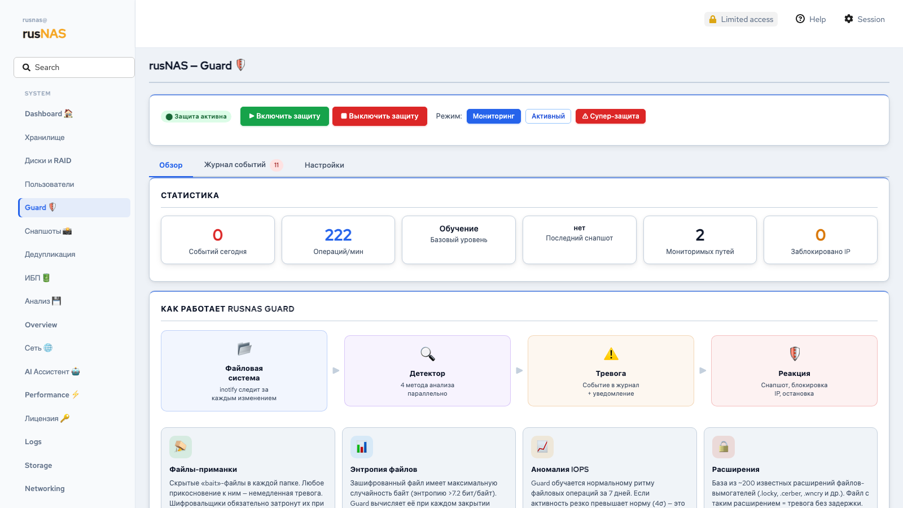

# Настройки Guard

*Рис. Настройки Guard — детекторы и пути*

Страница настроек Guard позволяет управлять методами обнаружения, защищаемыми директориями и параметрами реагирования.

---

## Как открыть

Откройте страницу **Guard** и перейдите на вкладку **"Настройки"**. Для изменения настроек потребуется ввести [PIN-код Guard](overview.md).

## Методы обнаружения

Каждый метод можно включить или отключить независимо:

| Метод | Переключатель | Рекомендация |
|-------|--------------|--------------|
| **Ловушки (Honeypot)** | Вкл/Выкл | Оставить включённым. Самый надёжный метод с минимумом ложных срабатываний |
| **Анализ энтропии** | Вкл/Выкл | Включить. Может давать редкие ложные срабатывания на архивах и мультимедиа |
| **Мониторинг IOPS** | Вкл/Выкл | Включить. Отключить, если на сервере регулярно выполняются массовые операции с файлами |
| **Контроль расширений** | Вкл/Выкл | Включить. Дополнительный слой защиты |

### Порог энтропии

Для метода анализа энтропии можно настроить порог срабатывания:

- **Значение по умолчанию:** 7.5 (из 8.0)
- **Ниже = чувствительнее:** больше срабатываний, включая ложные
- **Выше = менее чувствительно:** меньше ложных срабатываний, но может пропустить атаку

!!! tip "Совет"
    Для большинства рабочих нагрузок значение 7.5 оптимально. Если вы работаете с большим количеством сжатых файлов (архивы, видео), увеличьте порог до 7.8.

## Защищаемые директории

Раздел отображает список директорий, которые Guard мониторит.

### Добавление директории

1. Нажмите **"+ Добавить путь"**
2. Введите полный путь к директории (например, `/mnt/data/public`)
3. Нажмите **"Сохранить"**

### Удаление директории

1. Найдите директорию в списке
2. Нажмите **"Удалить"** рядом с ней
3. Подтвердите действие

!!! note "Примечание"
    Рекомендуется мониторить директории, доступные по сети (SMB/NFS-шары). Именно через них чаще всего происходят атаки шифровальщиков.

## Скрытие ловушек из SMB

По умолчанию файлы-ловушки (honeypot) скрыты от пользователей при просмотре SMB-шар. Этот параметр управляется переключателем:

- **Скрывать ловушки из SMB** (рекомендуется) -- пользователи не видят служебные файлы
- **Показывать ловушки** -- файлы видны, что может вызвать вопросы пользователей

!!! warning "Внимание"
    Если ловушки видны пользователям, они могут случайно их удалить или изменить, что вызовет ложное срабатывание.

## Настройка снапшотов при атаке

Можно настроить автоматическое создание снапшота при обнаружении атаки:

- **Авто-снапшот при атаке:** Вкл/Выкл
- При включении Guard создаст снапшот защищаемого тома в момент обнаружения угрозы

Это позволяет восстановить данные до состояния непосредственно перед атакой.

## Смена PIN-кода

1. В настройках Guard нажмите **"Сменить PIN"**
2. Введите текущий PIN
3. Введите новый PIN дважды
4. Нажмите **"Сохранить"**

!!! danger "Важно"
    Запишите новый PIN в безопасном месте. Восстановление PIN через веб-интерфейс невозможно. Сброс возможен только через SSH: `sudo rusnas-guard --reset-pin`.

## Управление блокировками

В активном и супер-безопасном режимах Guard может заблокировать SMB-сессию подозрительного пользователя. Для разблокировки:

1. Перейдите на вкладку **"Журнал событий"**
2. Найдите событие блокировки
3. Нажмите **"Разблокировать"**
4. Введите PIN-код Guard

## Запуск и остановка детектора

Кнопки **"Запустить"** и **"Остановить"** управляют модулем обнаружения угроз. Фоновый сервис Guard всегда работает -- кнопки влияют только на активный мониторинг.

- **Запустить** -- Guard начинает отслеживать файловые операции
- **Остановить** -- мониторинг приостанавливается (журнал и настройки доступны)

---

**См. также:** [Guard: обзор](overview.md) | [Журнал событий](events.md) | [Снапшоты](../snapshots/manage.md)
