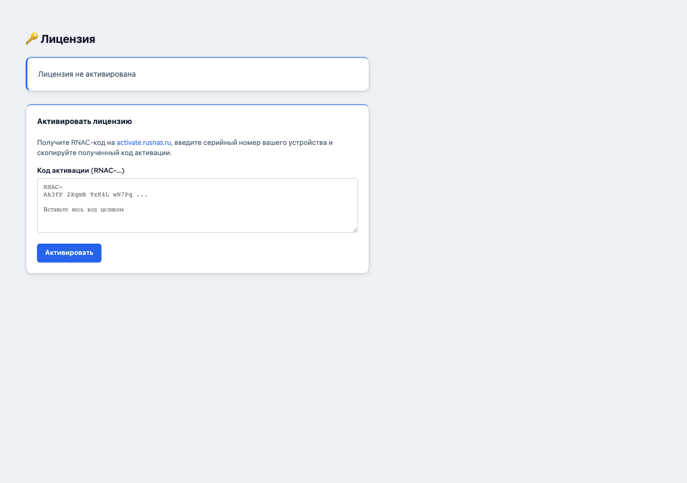

# Лицензирование

Лицензия rusNAS привязывается к конкретному устройству при первом запуске. Страница лицензирования позволяет активировать, проверить и продлить лицензию.

---

## Где найти

Откройте страницу **Лицензия** в боковой панели.

## Состояния лицензии

| Состояние | Описание |
|-----------|----------|
| **Активна** | Лицензия действительна, все функции доступны |
| **Не активирована** | Устройство ещё не активировано — требуется серийный номер |
| **Истекла** | Срок действия лицензии закончился — обновления недоступны |
| **Демо** | Пробный период (ограниченный функционал или срок) |

## Активация лицензии

### 1. Получение серийного номера

Серийный номер предоставляется при покупке rusNAS. Формат: `XXXXX-XXXXX-XXXXX-XXXXX`.

### 2. Ввод серийного номера

1. Откройте страницу **Лицензия**
2. Введите серийный номер в поле активации
3. Нажмите **Активировать**
4. Дождитесь подтверждения от сервера лицензий

### 3. Проверка статуса

После активации на странице отображаются:

- Серийный номер (частично скрыт)
- Дата активации
- Дата окончания лицензии
- Тип лицензии
- Аппаратный ID устройства

## Проверка подлинности

Лицензия защищена цифровой подписью Ed25519. Проверка выполняется локально на устройстве — не требует подключения к интернету после активации.

!!! info "Офлайн-работа"
    После первичной активации rusNAS работает полностью автономно. Подключение к серверу лицензий нужно только для активации и обновлений.

## Обновление лицензии

При истечении срока действия:

1. Получите новый серийный номер (продление)
2. Введите его на странице **Лицензия**
3. Нажмите **Активировать** — старая лицензия будет заменена

## Привязка к устройству

Лицензия привязывается к аппаратному идентификатору (Machine ID) устройства. При замене оборудования может потребоваться перенос лицензии — обратитесь в техническую поддержку.

!!! warning "Важно"
    Серийный номер нельзя использовать на нескольких устройствах одновременно. Каждое устройство требует отдельную лицензию.
