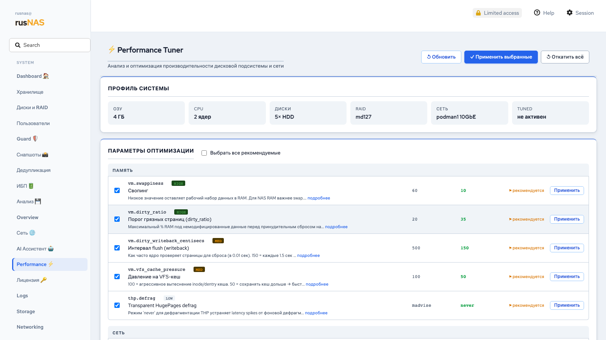

# Оптимизация производительности

*Рис. Страница оптимизации производительности*

Performance Tuner -- модуль автоматической оптимизации дисковой подсистемы, сети и системных параметров RusNAS. Система анализирует аппаратную конфигурацию и предлагает оптимальные настройки для вашего сценария использования.

---

## Где найти

Откройте страницу **Оптимизация** в боковой панели.

## Принцип работы

1. Performance Tuner анализирует аппаратное обеспечение: CPU, RAM, диски, сетевые адаптеры
2. Определяет текущий профиль нагрузки (файловый сервер, база данных, виртуализация)
3. Предлагает оптимальные значения для 12 категорий параметров
4. Позволяет применить настройки по одной или все сразу
5. Поддерживает откат любого изменения

## Профили нагрузки

При первом открытии система определяет профиль автоматически. Вы можете выбрать другой:

| Профиль | Описание | Оптимизация |
|---------|----------|-------------|
| **Файловый сервер** | SMB/NFS-шары для офисной работы | Баланс чтения и записи |
| **Медиа-хранилище** | Хранение и стриминг видео/аудио | Большие буферы, потоковое чтение |
| **Виртуализация** | Хранилище для ВМ (iSCSI/NFS) | Низкая задержка, высокий IOPS |
| **Резервное копирование** | Бэкапы и архивы | Максимальная пропускная способность записи |

## 12 категорий оптимизации

### Память и подкачка (VM)

| Параметр | Описание |
|----------|----------|
| **Swappiness** | Склонность к использованию подкачки (0-100). Низкое значение = меньше подкачки |
| **Dirty ratio** | Процент RAM для буферизации записи перед сбросом на диск |
| **Dirty background ratio** | Порог фоновой записи |
| **VFS cache pressure** | Приоритет кеширования метаданных файловой системы |

### Планировщик ввода-вывода

Выбор планировщика: `mq-deadline` (рекомендуется для HDD), `none`/`noop` (для SSD), `bfq` (для интерактивных нагрузок).

### Read-ahead

Размер буфера опережающего чтения. Увеличение ускоряет последовательное чтение, но может замедлить случайный доступ.

### Параметры RAID

Размер кеша полосок (stripe cache) для mdadm-массивов. Влияет на производительность RAID 5/6.

### Параметры Btrfs

Опции монтирования файловой системы: `compress`, `noatime`, `space_cache` и другие.

### Сетевые параметры

Буферы TCP, размеры окна, настройки backlog.

### Параметры NIC

Настройки сетевого адаптера через ethtool: offloading, ring buffers.

### Samba

Параметры производительности SMB-сервера: `socket options`, `use sendfile`, `aio read size`.

### NFS

Количество потоков nfsd и параметры кеширования.

### CPU Governor

Режим управления частотой процессора: `performance` (максимальная частота), `powersave` (экономия), `ondemand` (авто).

### IRQ Balancing

Распределение прерываний по ядрам процессора для оптимизации нагрузки.

### TuneD

Интеграция с системным профилем TuneD.

## Применение оптимизаций

### По одной

1. Просмотрите каждую категорию на странице
2. Для каждого параметра отображается:
    - **Текущее значение** -- что настроено сейчас
    - **Рекомендуемое** -- что предлагает система
    - **Статус** -- совпадает ли текущее с рекомендуемым
3. Нажмите **"Применить"** рядом с параметром для его изменения

### Все сразу

Нажмите **"Применить все рекомендации"** для одновременного изменения всех параметров.

!!! note "Примечание"
    Применённые настройки действуют немедленно (в памяти). Для сохранения после перезагрузки нажмите **"Сохранить на диск"** -- настройки записываются в системные конфигурационные файлы.

## Откат изменений

Каждый применённый параметр можно откатить:

1. Найдите параметр на странице
2. Нажмите **"Откатить"** для возврата к предыдущему значению

!!! tip "Совет"
    Рекомендуется применять оптимизации по одной и проверять стабильность после каждого изменения, особенно для параметров памяти и сети.

---

**См. также:** [SSD-кеширование](../raid/ssd-cache.md) | [Резервный режим](../raid/backup-mode.md)
