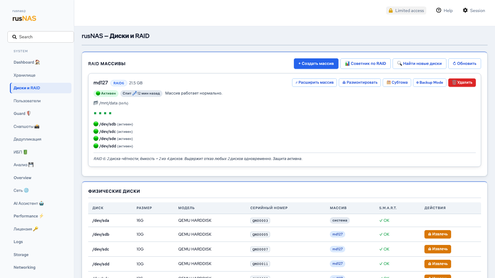

# SSD-кеширование

*Рис. Секция SSD-кеширования на странице Дисков*

SSD-кеширование позволяет использовать быстрый SSD-диск для ускорения операций ввода-вывода на RAID-массиве из обычных жёстких дисков. Часто запрашиваемые данные копируются на SSD, обеспечивая значительный прирост скорости чтения.

---

## Принцип работы

Технология dm-cache (LVM) создаёт кеширующий слой между приложениями и основным хранилищем:

1. При первом чтении данных они копируются с HDD на SSD-кеш
2. При повторном запросе данные отдаются с SSD (в десятки раз быстрее)
3. Записи в зависимости от режима либо проходят через кеш, либо идут напрямую на HDD

## Режимы кеширования

| Режим | Описание | Безопасность | Производительность |
|-------|----------|-------------|-------------------|
| **Writethrough** | Данные записываются одновременно на SSD и HDD. При отказе SSD данные не теряются | Высокая | Ускорение только чтения |
| **Writeback** | Данные сначала записываются на SSD, затем фоново переносятся на HDD. Ускоряет и чтение, и запись | Средняя -- при отказе SSD возможна потеря незаписанных данных | Ускорение чтения и записи |

!!! warning "Внимание"
    Режим Writeback обеспечивает лучшую производительность, но при внезапном отказе SSD (без корректного отключения) возможна потеря недавно записанных данных. Используйте [ИБП](../ups/setup.md) для защиты.

## Где найти

Настройки SSD-кеширования находятся на странице **"Диски и RAID"** в разделе **"SSD-кеш"** (панель под карточками массивов).

## Добавление SSD-кеша

1. Подключите SSD к серверу
2. На странице **"Диски и RAID"** убедитесь, что SSD обнаружен в списке физических дисков
3. В разделе **"SSD-кеш"** нажмите **"+ Добавить кеш"**
4. Выберите параметры:

| Поле | Описание |
|------|----------|
| **SSD-диск** | Выберите SSD из списка свободных дисков |
| **Целевой массив** | RAID-массив, для которого создаётся кеш |
| **Режим** | Writethrough (рекомендуется) или Writeback |

5. Нажмите **"Создать"**

!!! note "Примечание"
    SSD будет полностью использован для кеширования. Все данные на нём будут удалены.

## Мониторинг эффективности

После активации кеша в панели отображается:

| Метрика | Описание |
|---------|----------|
| **Hit Rate** | Процент запросов, обслуженных из кеша. Чем выше, тем эффективнее кеш |
| **Использование** | Какой процент кеша заполнен |
| **Режим** | Текущий режим работы (writethrough/writeback) |
| **Статус** | Активен / Неактивен |

Хороший показатель Hit Rate -- выше 60%. Если Hit Rate ниже 30%, ваша рабочая нагрузка плохо кешируется (например, преимущественно линейная запись больших файлов).

## Удаление SSD-кеша

1. В разделе **"SSD-кеш"** нажмите **"Удалить"** рядом с кешем
2. Подтвердите удаление
3. Система безопасно отключит кеш:
    - Для writeback: сначала сбросит все кешированные данные на HDD
    - Затем отключит SSD от массива

!!! tip "Совет"
    SSD-кеш наиболее эффективен при смешанной нагрузке: множество мелких файлов (документы, виртуальные машины, базы данных). Для потоковой записи больших файлов (видеонаблюдение) кеш даёт минимальный эффект.

## Рекомендации по выбору SSD

- **Ёмкость:** 10-20% от объёма основного массива достаточно для большинства нагрузок
- **Тип:** серверные SSD с высоким ресурсом записи (TBW) предпочтительны
- **Интерфейс:** NVMe обеспечит лучшую производительность, SATA SSD тоже подойдёт

---

**См. также:** [Создание массива](create.md) | [Оптимизация производительности](../performance/index.md)
