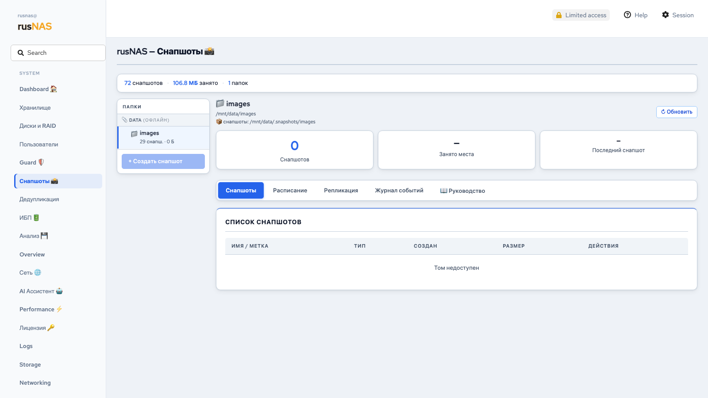

# Репликация снапшотов

*Рис. Настройка репликации снапшотов*

Репликация позволяет автоматически копировать снапшоты на удалённый сервер по SSH. Это обеспечивает защиту данных от аппаратных сбоев, краж и стихийных бедствий -- даже при полном выходе из строя основного сервера данные можно восстановить с удалённой копии.

---

## Принцип работы

1. RusNAS создаёт Btrfs-снапшот на локальном сервере
2. Снапшот передаётся через SSH на удалённый сервер с помощью `btrfs send/receive`
3. Первая передача -- полная копия всех данных
4. Последующие передачи -- только изменения (инкрементальные), что значительно экономит время и трафик

## Где найти

Откройте страницу **Снапшоты** и перейдите на вкладку **"Репликация"**.

## Подготовка

### Требования к удалённому серверу

- Операционная система Linux с поддержкой Btrfs
- Смонтированный том Btrfs для приёма снапшотов
- SSH-доступ (рекомендуется по ключу, без пароля)
- Достаточно свободного пространства

### Настройка SSH-ключей

Для автоматической репликации необходимо настроить SSH-доступ без пароля:

1. На сервере RusNAS сгенерируйте SSH-ключ (если ещё не создан)
2. Скопируйте публичный ключ на удалённый сервер
3. Проверьте, что подключение по SSH работает без запроса пароля

!!! warning "Внимание"
    Настройка SSH-ключей выполняется через командную строку (SSH-доступ к серверу RusNAS). Веб-интерфейс позволяет проверить доступность удалённого сервера, но не настраивает ключи.

## Создание задачи репликации

1. Нажмите **"+ Добавить задачу"**
2. Заполните параметры:

| Поле | Описание |
|------|----------|
| **Субтом** | Локальный субтом Btrfs для репликации |
| **Удалённый хост** | IP-адрес или имя удалённого сервера |
| **Пользователь** | Имя пользователя для SSH-подключения |
| **Путь на удалённом сервере** | Директория на удалённом Btrfs-томе для приёма снапшотов |

3. Нажмите **"Проверить соединение"** для проверки доступности
4. Если проверка успешна, нажмите **"Сохранить"**

## Список задач

Таблица отображает все настроенные задачи репликации:

| Столбец | Описание |
|---------|----------|
| **Субтом** | Что реплицируется |
| **Назначение** | Куда (хост + путь) |
| **Последний запуск** | Дата и результат последней репликации |
| **Статус** | Успешно / Ошибка / В процессе |
| **Действия** | Запуск, редактирование, удаление |

## Ручной запуск

1. Найдите задачу в таблице
2. Нажмите **"Запустить"**
3. Прогресс отображается в строке задачи

## Автоматический запуск

Репликация запускается автоматически по таймеру (каждые 5 минут проверяется, есть ли новые снапшоты для передачи). Если с момента последней репликации появились новые снапшоты, они будут переданы.

## Полная и инкрементальная передача

| Тип | Когда | Что передаётся | Время |
|-----|-------|----------------|-------|
| **Полная** | Первый запуск задачи | Весь снапшот целиком | Зависит от объёма данных и скорости сети |
| **Инкрементальная** | Все последующие | Только изменения с момента последнего переданного снапшота | Значительно быстрее |

!!! note "Примечание"
    Инкрементальная передача работает автоматически. Система сравнивает последний переданный снапшот с текущим и передаёт только разницу.

## Мониторинг

При активной передаче данных:

- В столбце "Статус" отображается **"В процессе"**
- Отображается объём переданных данных
- После завершения -- результат (успех или ошибка)

## Удаление задачи

1. Нажмите **"Удалить"** рядом с задачей
2. Подтвердите действие

!!! note "Примечание"
    Удаление задачи не удаляет уже переданные снапшоты с удалённого сервера. Для их очистки подключитесь к удалённому серверу напрямую.

## Рекомендации

- Используйте гигабитное или более быстрое сетевое подключение
- Для репликации через интернет настройте VPN-туннель для защиты трафика
- Регулярно проверяйте доступность удалённого сервера
- Убедитесь, что на удалённом сервере достаточно свободного места

---

**См. также:** [Управление снапшотами](manage.md) | [Расписание снапшотов](schedule.md)
