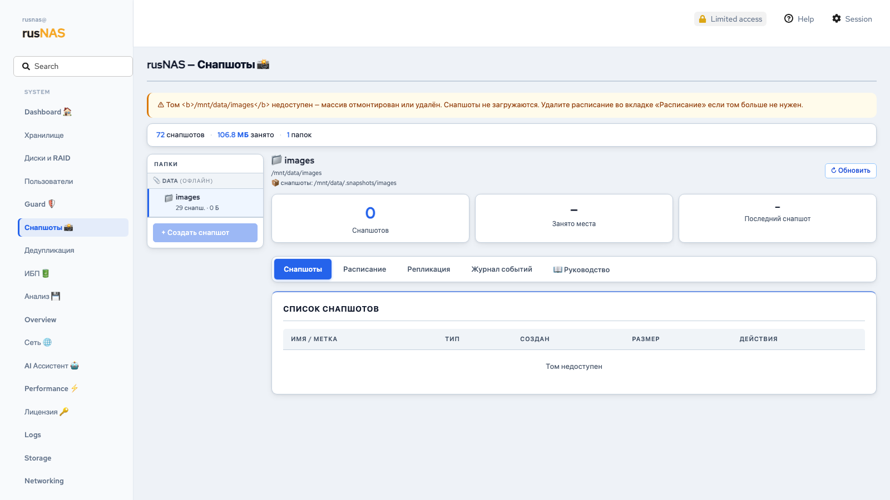

# Расписание снапшотов

*Рис. Расписание автоматических снапшотов*

Автоматические снапшоты по расписанию обеспечивают регулярное сохранение состояния данных без участия администратора.

---

## Где найти

Откройте страницу **Снапшоты** и перейдите на вкладку **"Расписание"**.

## Создание расписания

1. Нажмите **"+ Добавить расписание"**
2. Заполните параметры:

| Поле | Описание |
|------|----------|
| **Субтом** | Выберите субтом Btrfs, для которого создаётся расписание |
| **Частота** | Как часто создавать снапшоты: каждый час / каждый день / каждую неделю / каждый месяц |
| **Время** | Для ежедневных: час создания. Для еженедельных: день недели и час. Для ежемесячных: число и час |
| **Включено** | Активировать расписание сразу |

3. Нажмите **"Сохранить"**

!!! tip "Совет"
    Для рабочих данных (документы, проекты) рекомендуется ежечасное расписание. Для архивов и медиа достаточно ежедневного.

## Политика хранения (Retention)

Политика хранения определяет, сколько снапшотов каждого типа сохранять. Старые снапшоты удаляются автоматически при превышении лимита.

| Параметр | Описание | Рекомендация |
|----------|----------|--------------|
| **Ежечасные** | Количество последних ежечасных снапшотов | 24 (сутки) |
| **Ежедневные** | Количество последних ежедневных снапшотов | 7 (неделя) |
| **Еженедельные** | Количество последних еженедельных снапшотов | 4 (месяц) |
| **Ежемесячные** | Количество последних ежемесячных снапшотов | 12 (год) |

Пример: при настройке "24 ежечасных + 7 ежедневных + 4 еженедельных" вы сможете восстановить данные:

- За последние 24 часа -- с точностью до часа
- За последнюю неделю -- с точностью до дня
- За последний месяц -- с точностью до недели

## Список расписаний

Таблица отображает все настроенные расписания:

| Столбец | Описание |
|---------|----------|
| **Субтом** | Для какого субтома настроено |
| **Частота** | Интервал создания |
| **Следующий запуск** | Время следующего создания снапшота |
| **Статус** | Включено / Выключено |
| **Действия** | Редактирование, включение/отключение, удаление |

## Включение и отключение

Расписание можно временно отключить без удаления:

1. Найдите расписание в таблице
2. Нажмите переключатель в столбце **"Статус"**
3. Выключенное расписание сохраняется, но снапшоты не создаются

Это полезно при обслуживании или временном переносе данных.

## Редактирование расписания

1. Нажмите **"Редактировать"** рядом с расписанием
2. Измените нужные параметры
3. Нажмите **"Сохранить"**

## Удаление расписания

1. Нажмите **"Удалить"** рядом с расписанием
2. Подтвердите действие

!!! note "Примечание"
    Удаление расписания не удаляет уже созданные снапшоты. Они останутся в списке на вкладке "Снапшоты" и будут доступны для восстановления.

## Снапшоты перед обновлением

RusNAS автоматически создаёт снапшот перед каждым системным обновлением (`apt upgrade`). Эта функция работает независимо от расписания и не требует настройки.

Если обновление вызвало проблему, вы сможете восстановить данные из этого снапшота.

## Рекомендации

- Создайте хотя бы одно расписание для каждого субтома с данными
- Настройте политику хранения с учётом доступного места на диске
- [Заблокируйте](manage.md) важные снапшоты, чтобы политика хранения не удалила их
- Регулярно проверяйте, что снапшоты создаются (дата последнего снапшота в таблице)

---

**См. также:** [Управление снапшотами](manage.md) | [Репликация](replication.md)
