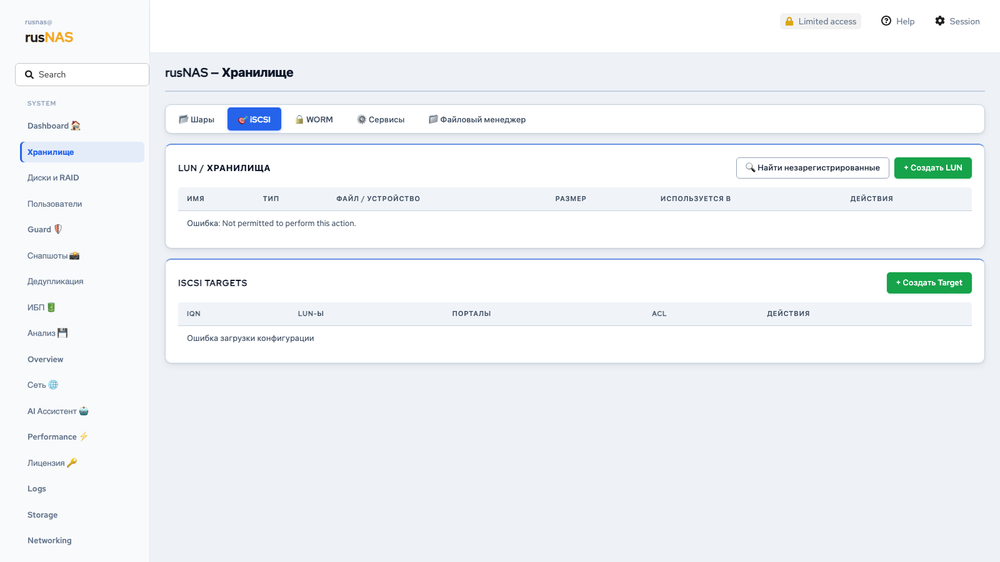

# WORM-защита

*Рис. Вкладка WORM — защита от перезаписи*

WORM (Write Once, Read Many) -- механизм защиты файлов от изменения и удаления. После помещения файла в WORM-защищённую директорию его невозможно изменить, переименовать или удалить до истечения срока хранения.

---

## Когда использовать WORM

- Хранение бухгалтерской и финансовой документации
- Соответствие требованиям регуляторов к хранению данных
- Защита архивов от случайного или преднамеренного удаления
- Хранение юридически значимых документов

## Где найти

Откройте страницу **Хранилище** и перейдите на вкладку **"WORM"**.

## Принцип работы

WORM в RusNAS работает на уровне директорий:

1. Вы указываете путь к директории, которую нужно защитить
2. Система устанавливает на файлы в этой директории атрибут неизменяемости
3. Новые файлы можно добавлять в директорию
4. Существующие файлы нельзя изменить или удалить
5. Снять защиту может только администратор через интерфейс RusNAS

## Добавление WORM-пути

1. На вкладке **"WORM"** нажмите **"+ Добавить путь"**
2. В модальном окне укажите:

| Поле | Описание |
|------|----------|
| **Путь** | Полный путь к директории на смонтированном томе (например, `/mnt/data/archive`) |

3. Нажмите **"Сохранить"**

!!! warning "Внимание"
    Перед включением WORM убедитесь, что все нужные файлы уже загружены в директорию в правильном виде. После включения защиты исправить файлы будет невозможно.

## Список защищённых путей

Таблица отображает все директории с активной WORM-защитой:

| Столбец | Описание |
|---------|----------|
| **Путь** | Защищённая директория |
| **Статус** | Активна / Неактивна |
| **Действия** | Удаление защиты |

## Удаление WORM-защиты

1. Найдите нужный путь в таблице
2. Нажмите кнопку **"Удалить"**
3. Подтвердите действие

После удаления WORM-защиты файлы в директории снова можно изменять и удалять.

!!! danger "Важно"
    Удаление WORM-защиты -- привилегированная операция. Убедитесь, что снятие защиты не нарушает требования вашей организации к хранению данных.

## Ограничения

- WORM работает только на смонтированных томах Btrfs
- Защита применяется к директории, а не к отдельным файлам
- Новые файлы, добавленные в защищённую директорию, автоматически получают защиту
- Поддиректории также защищаются

!!! tip "Совет"
    Для максимальной защиты данных комбинируйте WORM с [автоматическими снапшотами](../snapshots/schedule.md) и [Guard](../guard/overview.md).

---

**См. также:** [Общие папки](shares.md) | [Guard](../guard/overview.md) | [Снапшоты](../snapshots/manage.md)
