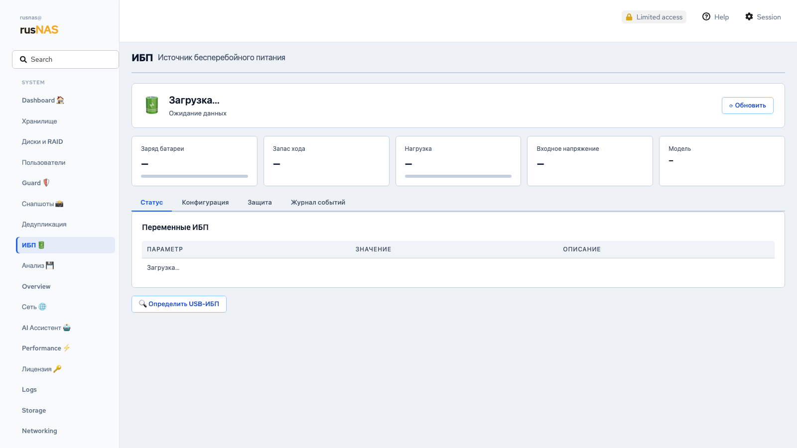

# ИБП: подключение и настройка

*Рис. Страница мониторинга ИБП*

Источник бесперебойного питания (ИБП / UPS) защищает сервер от потери данных при отключении электричества. RusNAS управляет ИБП через систему NUT (Network UPS Tools) и может автоматически корректно завершить работу при разряде батареи.

---

## Поддерживаемые подключения

| Тип | Описание | Кабель |
|-----|----------|--------|
| **USB** | Прямое подключение ИБП к серверу через USB | USB A-B (обычно идёт в комплекте с ИБП) |
| **SNMP** | Сетевое управление через протокол SNMP | Ethernet (ИБП с сетевой картой) |
| **Сетевой клиент** | Подключение к NUT-серверу другого компьютера | Ethernet (если ИБП подключён к другому серверу) |

## Где найти

Откройте страницу **ИБП** в боковой панели.

## Автоматическое обнаружение

При первом открытии страницы ИБП система автоматически сканирует подключённые устройства:

1. Если ИБП обнаружен по USB, его модель и параметры отобразятся на странице
2. Если ИБП не обнаружен, нажмите **"Сканировать устройства"** для повторного поиска

!!! note "Примечание"
    Для обнаружения ИБП по USB кабель должен быть подключён физически, а ИБП включён.

## Режимы работы NUT

При настройке ИБП выберите режим работы:

| Режим | Описание | Когда использовать |
|-------|----------|-------------------|
| **Standalone** | Сервер подключён напрямую к ИБП и управляет только собой | Один сервер + один ИБП |
| **Netserver** | Сервер подключён к ИБП и делится информацией с другими серверами по сети | Несколько серверов на одном ИБП |
| **Netclient** | Сервер получает информацию об ИБП от другого NUT-сервера по сети | Вторичный сервер на общем ИБП |

Для большинства установок подходит режим **Standalone**.

## Пошаговая настройка (USB)

1. Подключите ИБП к серверу USB-кабелем
2. Откройте страницу **ИБП**
3. Нажмите **"Сканировать устройства"** (если ИБП не обнаружен автоматически)
4. После обнаружения нажмите **"Настроить"**
5. Выберите режим: **Standalone**
6. Проверьте параметры:

| Параметр | Описание |
|----------|----------|
| **Драйвер** | Автоматически определяется при сканировании |
| **Порт** | USB-порт устройства (auto для USB-подключения) |
| **Имя** | Название ИБП в системе (произвольное, латиница) |

7. Нажмите **"Сохранить"**
8. Система запустит NUT-сервис и начнёт мониторинг

## Настройка сетевого клиента

Если ИБП подключён к другому серверу с NUT:

1. Выберите режим **Netclient**
2. Укажите параметры:

| Параметр | Описание |
|----------|----------|
| **Адрес NUT-сервера** | IP-адрес сервера, к которому подключён ИБП |
| **Имя ИБП** | Имя ИБП на удалённом NUT-сервере |
| **Логин** | Имя пользователя для подключения к NUT |
| **Пароль** | Пароль для подключения |

3. Нажмите **"Сохранить"**

## Перезапуск службы NUT

Если после изменения конфигурации мониторинг не работает:

1. Нажмите **"Перезапустить NUT"** на странице ИБП
2. Дождитесь перезапуска (несколько секунд)
3. Статус ИБП должен обновиться

!!! warning "Внимание"
    Не все модели ИБП поддерживаются NUT. Если ваш ИБП не обнаруживается, проверьте совместимость на сайте NUT (networkupstools.org).

---

**Следующий шаг:** [Мониторинг ИБП](monitoring.md)
