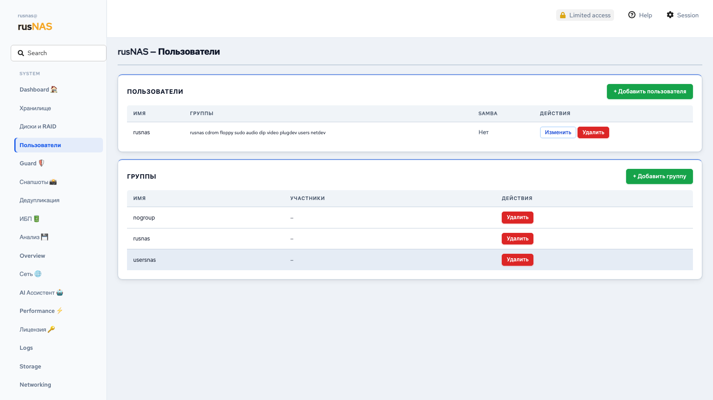
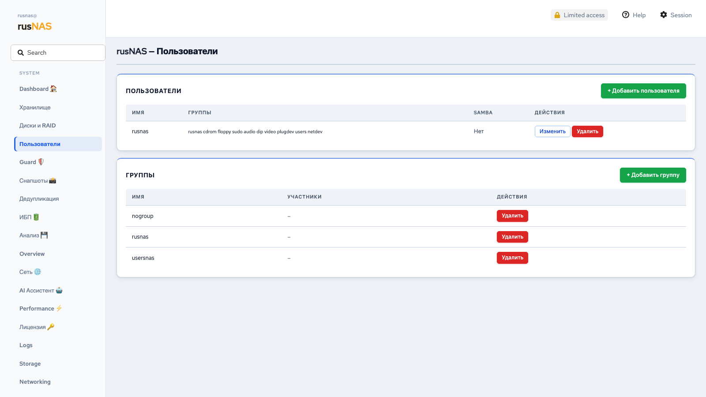

# Пользователи и группы

*Рис. Управление пользователями и группами*

Управление учётными записями пользователей и группами -- основа контроля доступа к данным на RusNAS. Каждый пользователь получает собственные учётные данные для подключения к общим папкам по SMB, FTP и другим протоколам.

---

## Где найти

Откройте страницу **Пользователи** в боковой панели.

## Список пользователей

Таблица отображает все учётные записи:

| Столбец | Описание |
|---------|----------|
| **Имя** | Логин пользователя |
| **UID** | Уникальный числовой идентификатор |
| **Группы** | Группы, в которых состоит пользователь |
| **Домашняя папка** | Путь к персональной директории |
| **Действия** | Редактирование, смена пароля, удаление |

## Создание пользователя

*Рис. Диалог создания пользователя*

1. Нажмите кнопку **"+ Создать пользователя"**
2. Заполните форму:

| Поле | Описание | Обязательное |
|------|----------|-------------|
| **Имя пользователя** | Логин (латиница, без пробелов, строчные буквы) | Да |
| **Пароль** | Пароль для входа. Рекомендуется минимум 8 символов | Да |
| **Подтверждение пароля** | Повторите пароль | Да |
| **Группы** | Выберите группы, в которые добавить пользователя | Нет |
| **Домашняя папка** | Путь к персональной директории (создаётся автоматически) | Нет |

3. Нажмите **"Создать"**

!!! note "Примечание"
    Созданная учётная запись является системной учётной записью Linux и автоматически доступна для подключения к SMB-шарам (через Samba). Отдельная настройка Samba не требуется.

## Смена пароля

1. Найдите пользователя в таблице
2. Нажмите **"Сменить пароль"** (значок ключа)
3. Введите новый пароль дважды
4. Нажмите **"Сохранить"**

Пароль изменяется одновременно в системе и в Samba.

## Редактирование пользователя

1. Нажмите **"Редактировать"** рядом с пользователем
2. Измените нужные параметры (группы, домашнюю папку)
3. Нажмите **"Сохранить"**

## Удаление пользователя

1. Нажмите **"Удалить"** рядом с пользователем
2. Система спросит, удалять ли домашнюю папку пользователя
3. Подтвердите удаление

!!! warning "Внимание"
    При удалении пользователя он теряет доступ ко всем общим папкам. Файлы, принадлежащие пользователю в общих папках, сохраняются, но право собственности может потребовать перенастройки.

## Группы

Группы упрощают управление доступом: вместо назначения прав каждому пользователю отдельно, вы назначаете права группе, и все её участники получают эти права.

### Создание группы

1. Перейдите в раздел **"Группы"** на странице пользователей
2. Нажмите **"+ Создать группу"**
3. Введите имя группы (латиница, без пробелов)
4. Нажмите **"Создать"**

### Добавление пользователя в группу

1. Редактируйте пользователя
2. В поле **"Группы"** отметьте нужные группы
3. Нажмите **"Сохранить"**

Или:

1. Редактируйте группу
2. В списке участников отметьте нужных пользователей
3. Нажмите **"Сохранить"**

### Удаление группы

1. Нажмите **"Удалить"** рядом с группой
2. Подтвердите действие

!!! note "Примечание"
    Удаление группы не удаляет пользователей -- они просто перестают быть участниками этой группы.

## Связь с общими папками

При [создании SMB-шары](../storage/shares.md) вы можете указать допустимых пользователей или группы. Только они смогут подключиться к шаре.

Пример настройки доступа:

- Шара **public** -- доступ для всех (гостевой или без ограничений)
- Шара **finance** -- доступ только для группы `accounting`
- Шара **personal** -- доступ только для пользователя `director`

## Рекомендации

- Создавайте именные учётные записи для каждого сотрудника -- это позволяет отслеживать, кто и когда обращался к файлам
- Используйте группы для управления доступом к шарам
- Устанавливайте сложные пароли (минимум 8 символов, буквы и цифры)
- Регулярно проверяйте список пользователей и удаляйте учётные записи уволенных сотрудников

---

**См. также:** [Общие папки](../storage/shares.md) | [Анализатор: пользователи](../analyzer/index.md)
